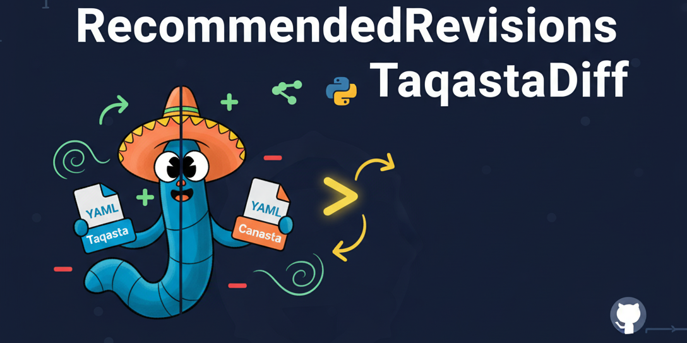

# RecommendedRevisionsTaqastaDiff



A comprehensive tool to compare Taqasta's `values.yml` with Canasta's recommended revisions YAML files. This tool helps identify differences in extensions, skins, composer packages, and repositories between the two MediaWiki distributions.

## Installation

### From Source (Recommended)

```bash
git clone https://github.com/WikiTeq/RecommendedRevisionsTaqastaDiff.git
cd RecommendedRevisionsTaqastaDiff
pip install -e .
```

### Install with Development Dependencies

For development with code quality tools:

```bash
pip install -e ".[dev]"
```

### Install Dependencies Only

```bash
pip install -r requirements.txt
```

## Usage

### Basic Usage

Compare Taqasta master branch with Canasta main branch (default):

```bash
yaml-diff-tool
```

Or using module execution:

```bash
python -m src.cli
```

### Advanced Usage

Compare specific branches:

```bash
yaml-diff-tool --taqasta-branch develop --canasta-branch develop
```

Compare specific commits:

```bash
yaml-diff-tool --taqasta-commit abc123 --canasta-commit def456
```

Save output to file:

```bash
yaml-diff-tool --output diff.txt
```

Use custom cache directory:

```bash
yaml-diff-tool --cache-dir /path/to/cache
```

### Command Line Options

- `--taqasta-branch BRANCH`: Branch of Taqasta repository to compare (default: master)
- `--canasta-branch BRANCH`: Branch of Canasta repository to compare (default: main)
- `--taqasta-commit COMMIT`: Specific commit hash of Taqasta repository
- `--canasta-commit COMMIT`: Specific commit hash of Canasta repository
- `--output FILE`: Output file to save the diff (default: stdout)
- `--cache-dir DIR`: Directory to cache downloaded YAML files
- `--help`: Show help message

## Features

- **GitHub Integration**: Fetches YAML files directly from GitHub repositories with intelligent caching
- **Comprehensive Comparison**: Analyzes extensions, skins, composer packages, and custom repositories
- **Detailed Diff Output**: Shows differences in commits, repositories, branches, and additional steps
- **Flexible CLI**: Support for branches, commits, output files, and custom cache directories
- **Error Handling**: Robust error handling for network issues, invalid inputs, and file system errors
- **High Performance**: Efficient caching reduces repeated GitHub requests
- **Well Tested**: 98% test coverage with 37 comprehensive tests

## Output Format

The tool generates detailed comparison reports showing:

### Extensions
- **Extensions only in Taqasta/Canasta**: Lists extensions unique to each repository
- **Extensions with different configurations**: Shows differences in:
  - Commit hashes
  - Repository URLs
  - Branch names
  - Additional steps (composer update, database update, etc.)

### Skins
- **Skins only in Taqasta/Canasta**: Lists skins unique to each repository
- **Skins with different configurations**: Shows differences in commit hashes and configurations

### Composer Packages
- **Composer packages only in Taqasta**: Lists packages requiring composer updates
- **Extensions requiring composer update only in Canasta**: Lists extensions that need composer updates

### Custom Repositories
- **Custom repositories only in Taqasta/Canasta**: Lists repository differences

## Example Output

```
Comparing Taqasta (master) vs Canasta (main)
======================================================================

EXTENSIONS:
  Extensions only in Taqasta:
    + AddMessages
        commit: a0af32f229d93016f3c3e80bcf2065e09f498064
    + Auth_remoteuser
        commit: c985d520c7aea38092ee7208be31f07a7251210d
    ...

  Extensions with different configurations:
    ~ AWS:
        Taqasta commit: 97c210475f82ed5bc86ea3cbf2726162ccbedbfe
        Canasta commit: f85bb579b57f22175ff0cbca7664ad26cacdbb58
        Taqasta repo: https://github.com/edwardspec/mediawiki-aws-s3.git
        Canasta repo: https://github.com/edwardspec/mediawiki-aws-s3
    ...
```

## Development

### Setup Development Environment

```bash
git clone https://github.com/WikiTeq/RecommendedRevisionsTaqastaDiff.git
cd RecommendedRevisionsTaqastaDiff
python -m venv venv
source venv/bin/activate  # On Windows: venv\Scripts\activate
pip install -e .
pip install -r requirements.txt
```

### Running Tests

Run all tests:

```bash
pytest
```

Run tests with coverage:

```bash
pytest --cov=src --cov-report=html
```

Run tests with coverage and fail if below 100%:

```bash
python run_tests.py
```

### Project Structure

```
RecommendedRevisionsTaqastaDiff/
├── src/
│   ├── __init__.py
│   ├── cli.py          # Command-line interface
│   ├── comparer.py     # YAML comparison logic
│   └── fetcher.py      # GitHub data fetching
├── tests/
│   ├── test_cli.py     # CLI tests
│   ├── test_comparer.py # Comparison tests
│   └── test_fetcher.py # Fetcher tests
├── pyproject.toml      # Package configuration
├── requirements.txt    # Dependencies
├── mascot.png         # Banner image
└── README.md          # This file
```

## Development

### Code Quality Tools

This project uses several tools to maintain high code quality:

- **[Black](https://black.readthedocs.io/)** - Code formatter (PEP 8 compliant)
- **[flake8](https://flake8.pycqa.org/)** - Linting and style checking
- **[mypy](https://mypy-lang.org/)** - Static type checking
- **[isort](https://pycqa.github.io/isort/)** - Import sorting
- **[pre-commit](https://pre-commit.com/)** - Git hook management

### Setting up Development Environment

1. Install development dependencies:
   ```bash
   pip install -e ".[dev]"
   ```

2. Install pre-commit hooks:
   ```bash
   pre-commit install
   ```

3. Run all quality checks:
   ```bash
   pre-commit run --all-files
   ```

### Quality Gates

The following checks run automatically on commits:

- **Code formatting** with Black
- **Import sorting** with isort
- **Linting** with flake8
- **Type checking** with mypy
- **Tests** with pytest (95% coverage minimum)

### Manual Quality Checks

```bash
# Run tests with coverage
python run_tests.py

# Type checking
mypy src/

# Linting
flake8 src/

# Code formatting
black src/
isort src/
```

## Contributing

1. Fork the repository
2. Create a feature branch (`git checkout -b feature/amazing-feature`)
3. Make your changes
4. Add tests for new functionality
5. Ensure all tests pass (`pytest`)
6. Commit your changes (`git commit -m 'Add amazing feature'`)
7. Push to the branch (`git push origin feature/amazing-feature`)
8. Open a Pull Request

## License

This project is part of the WikiTeq organization and follows their licensing terms.

## Support

For issues and questions:
- Create an issue on GitHub
- Check the test files for usage examples
- Review the CLI help: `yaml-diff-tool --help`
